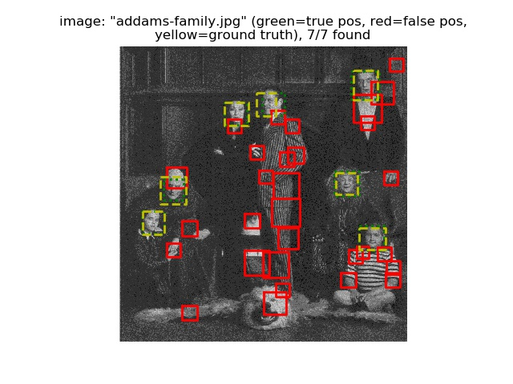
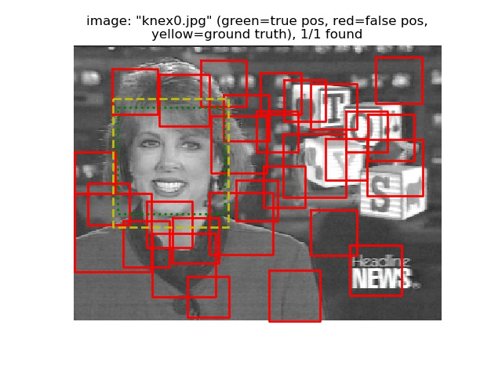
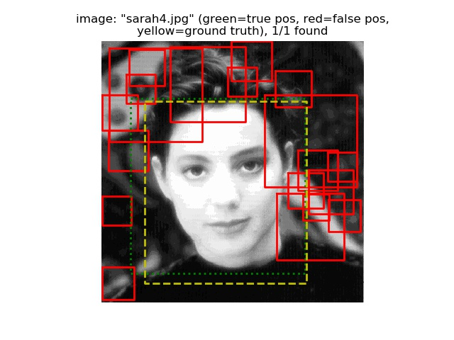
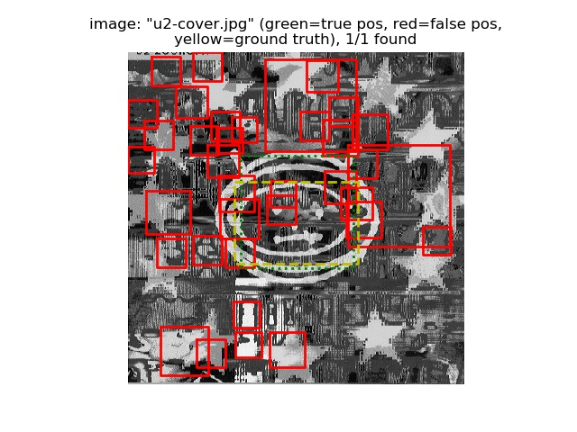
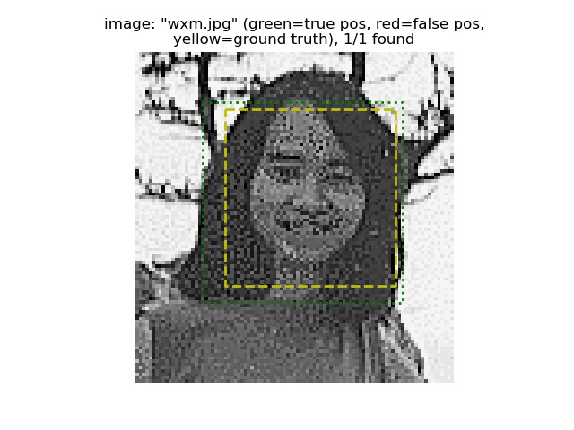

# 高聖倫 <span style="color:red">(106061851)</span>

#Project 4 / Face Detection with a Sliding Window

## Overview
The project is related to 
> Using a sliding window detector to classify all image patches as face or non-face, than train a **Linear_SVM** classifier with **HoG** features and test several images at multiple scales.

## Implementation
### 1.Training images
- `get_positive_features.py` :
	* read positive training images 
	* extract **HoG** features then turn into 1D array 
```python
    features_pos = []
    train_img = os.listdir(train_path_pos)
    for i in range(len(train_img)):
        img = imread(train_path_pos+ '/' +train_img[i], as_grey=True)
        hog_feat = hog(img, feature_params['hog_cell_size']).flatten()
        features_pos.append(hog_feat)
    features_pos = np.asarray(features_pos) # turn into ndarray
```

- `get_random_negative_features.py` :
	* read negative training images
	* modify colors to grey-scale
	* determine samples per image.
	* randomly choose sample points and cut needed amounts of image cells
	* extract **HoG** features then turn into 1D array
	* randomly delete redundant negative examples
```python
    features_neg = []
    templatesize = feature_params['template_size']
    images = [os.path.join(non_face_scn_path,f) for f in os.listdir(non_face_scn_path) if '.jpg' in f]    
    neg_examples = len(images)
    for i in range(len(images)):
        img = imread(images[i],as_grey=True)
        height = img.shape[0]
        width = img.shape[1]
        img_samples = int(np.ceil(num_samples/neg_examples))
        if min(width,height)-templatesize < img_samples:
            img_samples = min(width,height)-templatesize 
        height_index = np.random.choice(height-templatesize, img_samples, replace=False)
        width_index = np.random.choice(width-templatesize, img_samples, replace=False)

        for j in range(img_samples):
            img_cell = img[height_index[j]:height_index[j]+templatesize, width_index[j]:width_index[j]+templatesize]
            hog_feat = hog(img_cell, feature_params['hog_cell_size']).flatten()
            features_neg.append(hog_feat.tolist())
    if len(features_neg) > num_samples:
        feat_ix = np.random.choice(len(features_neg),num_samples,replace=False)
        features_neg = np.asarray(features_neg)[feat_ix]   #delete redundant negative examples
    else:
        features_neg = np.asarray(features_neg)
```

### 2. Training SVM classifier
- `svm_classify.py` :
	* optimize the C parameters by GridSearchCV
	* use features extracted above to fit the model 
```python
    svc = svm.SVC(gamma="scale")
    parameters = {'kernel':('linear', 'rbf'), 'C':[0.01, 1.0, 10.0, 30.0, 100.0]}
    clf = GridSearchCV(svc, parameters, cv=5)
    clf.fit(x, y)
```

### 3. Testing images at multiple scales
- `run_detector.py` :
	* read test images
	* scale down image then extract **HoG** features
	* cut little **HoG** segments and turn into 1D array
	* send segments to SVM, then get confidence
	* if confidence > threshold, then build bounding box
	* record box and image filename then back to step2 until the image is smaller than template size
```python
        img = imread(test_scn_path+ '/' +test_images[i], as_grey=True)
        scale = 1
        height = img.shape[0]
        width = img.shape[1]
        current_confidences = np.zeros([0, 1])
        current_image_ids = np.zeros([0, 1])
        current_bboxes = np.zeros([0, 4])
      
        while scale*min(height,width) > feature_params['template_size']:
            img_resize = resize(img, [int(height*scale), int(width*scale)])
            hog_feat = hog(img_resize, feature_params['hog_cell_size'])
            for xx in range(int(hog_feat.shape[0])-cell_num+1):
                for yy in range(int(hog_feat.shape[1])-cell_num+1):
                    hog_seg = np.reshape(hog_feat[xx:xx+cell_num, yy:yy+cell_num, :],(1,-1))
                    temp_confidence = np.reshape(model.decision_function(hog_seg),(1,-1))
                    if temp_confidence[0] > -0.5:  
                        current_confidences = np.concatenate([current_confidences, temp_confidence], 0)
                        x_min = int(yy*cell_size / scale)
                        x_max = int((yy + cell_num) * cell_size / scale)
                        y_min = int(xx*cell_size / scale)
                        y_max = int((xx + cell_num) * cell_size / scale)
                        temp_bboxes = np.array([[x_min, y_min, x_max, y_max]])
                        current_bboxes = np.concatenate([current_bboxes, temp_bboxes], 0)
                        current_image_ids = np.concatenate([current_image_ids, [[test_images[i]]]], 0)
            scale = scale * 0.9
```

## Installation
- Other required packages 
	* `sklearn` for machine learning
	* `matplotlib` for visualization
	* `cyvlfeat` for **HoG** features
	* `tqdm` for progress bar
	* `scikit-image` for image processing
- How to run your code? 
	* run proj4.py at folder"code"

## Results
- Parameter setting
	* 'template_size': 36, 'hog_cell_size': 3
	>If you choose smaller hog_cell_size, the higher average precision you will get, but cost more implementation time.

### Precision Recall curve for the modified code.
- Average Precision=0.91


- Detection result (130 figures)
<table border=1>
<tr>
<td>



</td>
</tr>

<tr>
<td>


</td>
</tr>

<tr>
<td>


</td>
</tr>

<tr>
<td>


</td>
</tr>

<tr>
<td>


</td>
</tr>

<tr>
<td>


</td>
</tr>

<tr>
<td>


</td>
</tr>

<tr>
<td>


</td>
</tr>

<tr>
<td>


</td>
</tr>
<tr>
<td>


</td>
</tr>
<tr>
<td>


</td>
</tr>
<tr>
<td>


</td>
</tr>
<tr>
<td>


</td>
</tr>
<tr>
<td>


</td>
</tr>

<tr>
<td>


</td>
</tr>
<tr>
<td>


</td>
</tr>
<tr>
<td>



</td>
</tr>
<tr>
<td>


</td>
</tr>
<tr>
<td>


</td>
</tr>

<tr>
<td>


</td>
</tr>
<tr>
<td>


</td>
</tr>
<tr>
<td>


</td>
</tr>
<tr>
<td>


</td>
</tr>
<tr>
<td>


</td>
</tr>
<tr>
<td>


</td>
</tr>
<tr>
<td>



</td>
</tr>
<tr>
<td>


</td>
</tr>
<tr>
<td>


</td>
</tr>
<tr>
<td>


</td>
</tr>
<tr>
<td>



</td>
</tr>
<tr>
<td>


</td>
</tr>
<tr>
<td>



</td>
</tr>
<tr>
<td>


</td>
</tr>
</table>
